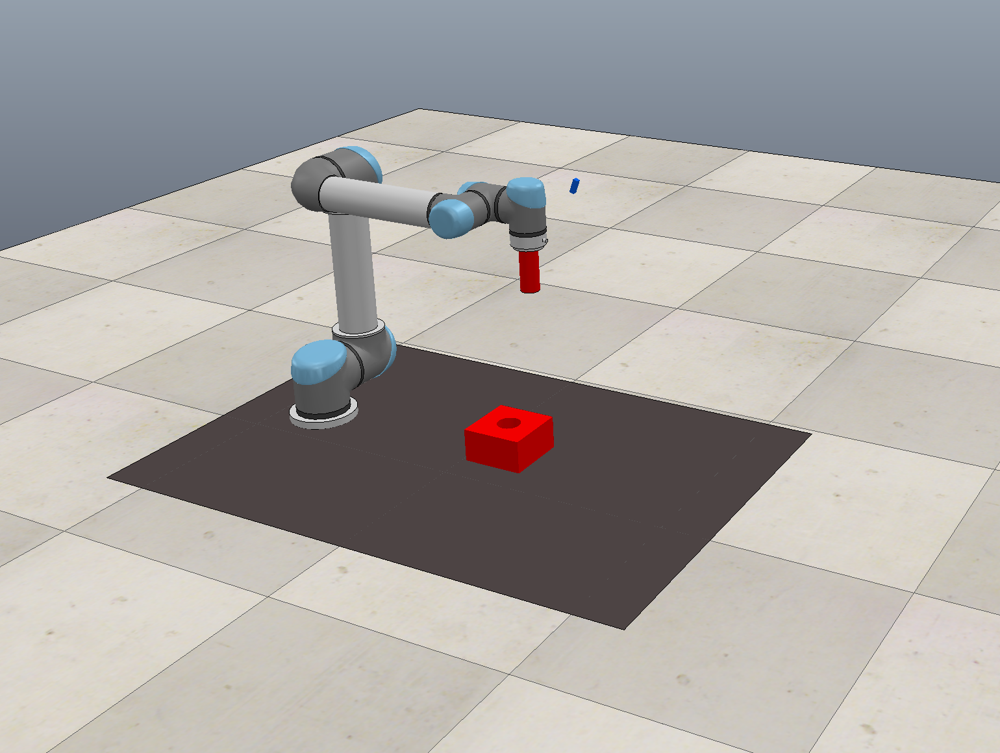
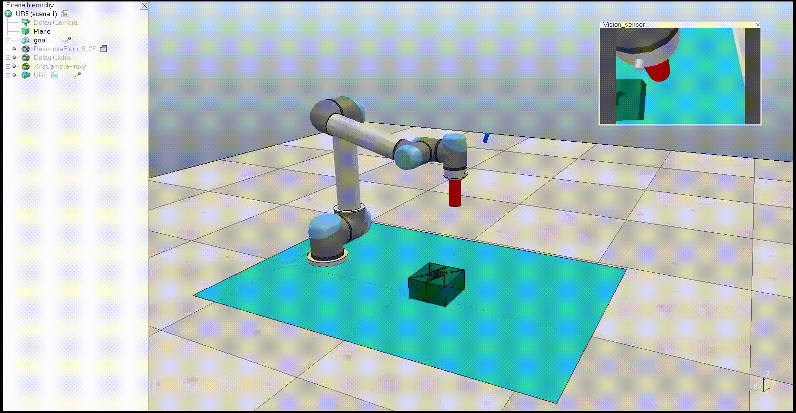

# Peg-in-a-hole-insertion-using-DRL
Simulation and training a UR5 robot to accurately insert a pin into a hole using the CoppeliaSim simulator and catalyst-rl reinforcement library

## Setup
1. Download the **robot simulation platform**, CoppeliaSim, from [the official website](https://www.coppeliarobotics.com/downloads) 

2. Setup **toolkit for robot learning research**, PyRep, from their [github repository](https://github.com/stepjam/PyRep). PyRep library is built on top of CoppeliaSim to facilitate prototyping in python.

3. The goal is to train a robot to perform peg-in-hole insertion. The simulation environment is in [CoppeliaSim](https://www.coppeliarobotics.com). The simulator comes with various robot manipulators and grippers. UR5 robot with RG2 gripper was used.
    

4. **Perform training**  
   Run `scripts/run-training.sh`
   

5. **Inference**  
Run `scripts/run-inference.sh`

